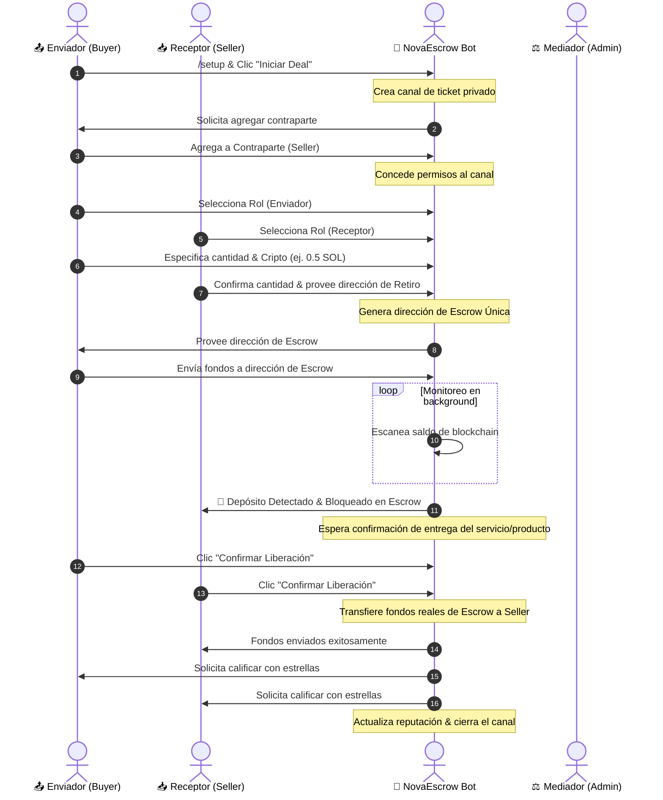

# 🔒 NovaEscrow — Multi-Chain Discord Escrow Bot

[](https://www.python.org)
[](https://discordpy.readthedocs.io/)
[](LICENSE)
[](https://github.com/)

**NovaEscrow** is a state-of-the-art, fully automated multi-chain cryptocurrency escrow bot designed for Discord communities. It enables secure, trustless Peer-to-Peer (P2P) trading of cryptocurrencies directly within private channels, backed by real-time blockchain monitoring.

---

## 🚀 Key Features

* **🌐 Multi-Chain Integration:** Supports native transactions and tokens across multiple major blockchains:
  * **Bitcoin (BTC)** & **Litecoin (LTC)** (Legacy & Bech32 format).
  * **Ethereum (ETH)** & **ERC-20 Tokens** (USDT & USDC).
  * **Solana (SOL)** (Native token transfers).
* **🔑 Deterministic Wallet Derivation:** Dynamically derives unique, single-use escrow addresses for every single deal from a single `WALLET_MASTER_KEY` seed, utilizing cryptographic hashing and salt techniques.
* **🛡️ Fernet Private Key Encryption:** All Derived Private Keys are strongly encrypted in memory using AES-128 in CBC mode with HMAC-SHA256 (Fernet) ensuring that private keys are never handled or stored in plain-text.
* **🤖 Automatic Blockchain Verification:** Continuous background workers track the blockchain status using direct RPC nodes (Ethereum Web3, Solana Web3, and BlockCypher APIs) to detect incoming deposits automatically.
* **⚖️ Dual-Signature Release & Dispute System:**
  * Fund release requires confirmation from both the Buyer (Sender) and Seller (Receptor).
  * Built-in dispute mechanism allows administrators to step in as mediators and execute refunds or payouts.
* **📈 Reputation & Trading Profiles:** Tracks user statistics including completed trade counts, total trading volume (USD), average star-ratings, and written reviews.
* **💼 Internal Wallet System:** Allows users to maintain an internal trading balance to execute instant, gas-free trades or withdraw funds to their external wallets at any time.

---

## 📊 Secure Deal Flow



---

## 📂 Project Structure

The project follows a clean, highly decoupled **Modular Cog-based Architecture** to ensure maximum maintainability:

```text
NovaEscrow/
│
├── src/
│   ├── database/               # Database interactions (SQLite / Aiosqlite)
│   │   └── manager.py          # Tables initialization, profile queries, and balance updates
│   │
│   ├── services/               # Core Blockchain Integrations
│   │   └── wallet.py           # Keys derivation, transaction building, and balance verification
│   │
│   ├── utils/                  # Shared Utility helpers
│   │   └── logging.py          # Structured audit logging channel
│   │
│   ├── ui/                     # Discord Interactive UI Layer
│   │   └── views.py            # Buttons, Modals, Dropdowns, and Background monitoring tasks
│   │
│   └── cogs/                   # Modular Slash Command Domains
│       ├── escrow.py           # Commands: /setup, /cerrar, /info, /stats, /perfil
│       └── balance.py          # Commands: /balance, /depositar, /retirar
│
├── main.py                     # Clean, lightweight application entry point
├── pyproject.toml              # Project dependencies and packaging
├── .env.example                # Template for server-side environments
└── README.md                   # This documentation
```

---

## 🛠️ Installation & Setup

### 1. Prerequisites
Ensure you have Python 3.10 or higher installed. It is highly recommended to use [uv](https://github.com/astral-sh/uv) or `pip` to manage virtual environments.

### 2. Clone the Repository
```bash
git clone https://github.com/your-username/NovaEscrow.git
cd NovaEscrow
```

### 3. Install Dependencies
```bash
pip install -e .
```

### 4. Configure Environment Variables
Copy `.env.example` to `.env` and fill in the required keys:
```bash
cp .env.example .env
```

Edit the `.env` file:
```env
# Discord Configuration
DISCORD_TOKEN=your_discord_bot_token_here
LOG_CHANNEL_ID=your_discord_log_channel_id_here

# Blockchain Configuration (Escrow Operations)
WALLET_MASTER_KEY=your_cryptographically_secure_master_key_here
INFURA_URL=https://mainnet.infura.io/v3/your_infura_project_id
SOLANA_RPC=https://api.mainnet-beta.solana.com
BLOCKCYPHER_TOKEN=your_blockcypher_api_token_here
```

> [!IMPORTANT]
> **WALLET_MASTER_KEY:** Keep this value extremely secure. All single-use escrow addresses and private keys are deterministically generated from this key. If lost, escrow funds cannot be retrieved; if leaked, hackers can intercept derived keys. Use a strong secret (the bot will generate one automatically if left empty, but it is best to set a persistent one).

---

## 📊 Bot Slash Commands

### 🛡️ Administration
* `/setup` - Configures the current channel as the central gateway for starting Escrow deals (requires administrator privileges).

### 👥 Deal Operations
* `/cerrar` - Cleanly closes and deletes the current active ticket channel (can be triggered by deal participants or server admins).

### 👤 Profile & Analytics
* `/perfil [@usuario]` - Displays trading stats (completed deals, reputation stars, trading volume in USD) of a user.
* `/info` - Shows general bot features, supported cryptocurrencies, and available commands list.
* `/stats` - Displays global server statistics (total escrow tickets, completed deals, active disputes).

### 💼 Portfolio Management
* `/balance` - Shows the user's secure internal wallet balances across all supported cryptocurrencies.
* `/depositar` - Provides a deterministic address to top up the user's internal trading wallet.
* `/retirar` - Prompts a modal to securely transfer internal wallet funds to an external blockchain address.

---

## 🛡️ Security Best Practices

1. **Deterministic Isolation:** Single-use keypairs are dynamically derived with custom channel IDs and nonces, preventing wallet address reuse across deals.
2. **Secure Key Loading:** Master keys and Infura/Solana RPC URLs are loaded strictly from the system environment (`.env`) and never hardcoded.
3. **Audit Trails:** Every event (roles confirmation, deposits, releases, disputes, and withdrawals) publishes comprehensive audit logs to a dedicated administration channel (`LOG_CHANNEL_ID`).
4. **No Plaintext Private Keys:** Temporary private keys are encrypted instantly upon derivation using AES-128 Fernet encryption, and only decrypted in-memory during transaction signing.

---

## 📄 License
This project is licensed under the "Licencia de Software Libre con Atribución Obligatoria (Licencia Alberto Ortiz)" - see the [LICENSE](LICENSE) file for details.
